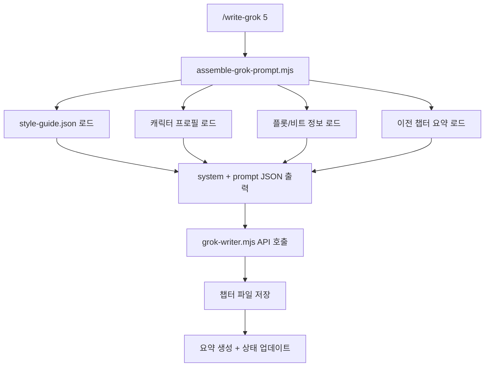

# Write-Grok 상세 가이드

## 개요

`/write-grok`은 xAI의 Grok API를 사용하여 소설 콘텐츠를 생성하는 스킬입니다. Claude의 콘텐츠 정책으로 인해 생성이 제한되는 장면에 대안으로 사용할 수 있습니다.

## xAI Grok API 소개

### Grok이란?

xAI에서 개발한 대규모 언어 모델로, Elon Musk의 X (구 Twitter) 플랫폼과 통합되어 있습니다.

**특징:**
- Claude보다 콘텐츠 제한이 덜 엄격함
- 한국어 지원 우수
- 창의적 글쓰기에 적합
- 실시간 정보 접근 가능 (일부 모델)

### 사용 가능한 모델

| 모델 ID | 설명 | 특성 |
|---------|------|------|
| `grok-3` | 기본 모델 | 균형잡힌 성능, 안정적 |
| `grok-4-1-fast` | 최신 모델 | 빠른 응답, 높은 품질 |
| `grok-4-1-fast-reasoning` | 추론 강화 | 복잡한 플롯에 적합 |

## 설정

### API 키 발급

1. https://console.x.ai 접속
2. 계정 생성 또는 로그인
3. API Keys 섹션에서 새 키 생성
4. 키를 안전한 곳에 저장

### 환경 변수 설정

**방법 1: ~/.env 파일 (권장)**
```bash
# ~/.env
XAI_API_KEY=xai-xxxxxxxxxxxxxxxxxxxx
```

**방법 2: 환경 변수 직접 설정**
```bash
export XAI_API_KEY=xai-xxxxxxxxxxxxxxxxxxxx
```

### 비용 구조

Grok API는 사용량 기반 과금입니다:

| 항목 | 비용 (예상) |
|------|------------|
| Input tokens | ~$0.002/1K |
| Output tokens | ~$0.006/1K |
| 5000자 챕터 1개 | ~$0.05-0.10 |

> 정확한 비용은 xAI 콘솔에서 확인하세요.

## 고급 사용법

### 시스템 프롬프트 커스터마이징

시스템 프롬프트로 작성 스타일을 제어할 수 있습니다:

**로맨스 특화:**
```
당신은 감성적인 한국 로맨스 소설 작가입니다.
섬세한 감정 묘사와 달콤한 대화를 잘 씁니다.
'보여주기' 기법을 사용하고, 직접적인 감정 서술은 피합니다.
```

**액션 특화:**
```
당신은 역동적인 액션 소설 작가입니다.
짧고 강렬한 문장, 빠른 페이싱을 사용합니다.
의성어와 의태어를 적극 활용합니다.
```

**스릴러 특화:**
```
당신은 긴장감 넘치는 스릴러 작가입니다.
서스펜스를 높이는 짧은 문장과 복선을 사용합니다.
독자가 불안을 느끼도록 분위기를 조성합니다.
```

### 파라미터 튜닝

**temperature (창의성)**
- `0.3-0.5`: 일관된 스타일, 예측 가능한 출력
- `0.6-0.8`: 균형잡힌 창의성 (권장)
- `0.9-1.0`: 예상치 못한 전개, 실험적

**max_tokens (길이)**
- `1000-2000`: 짧은 장면 (1-2페이지)
- `3000-4000`: 일반 챕터 (3-4페이지)
- `6000-8192`: 긴 챕터 (5-8페이지)

### 컨텍스트 주입

이전 장면과의 연속성을 위해 컨텍스트를 제공합니다.

> **참고:** `assemble-grok-prompt.mjs`가 이 과정을 자동화합니다. 챕터 번호를 지정하면 style-guide, 캐릭터 프로필, 이전 챕터 요약 등이 자동으로 조립되어 Grok에 전달됩니다. 아래는 수동으로 컨텍스트를 구성하는 레거시 방법입니다.

```bash
node scripts/grok-writer.mjs \
  --system "당신은 한국어 로맨스 작가입니다" \
  --prompt "
[이전 장면 요약]
- 유나와 민준이 우연히 같은 엘리베이터에 갇힘
- 서로의 과거에 대해 이야기함
- 분위기가 미묘하게 달라짐

[작성할 장면]
긴장감 속에서 서로를 바라보다가 키스하는 장면을 써주세요.
감정의 흐름을 섬세하게 묘사해주세요.
  " \
  --max-tokens 8192
```

## 워크플로우 통합

### assemble-grok-prompt.mjs 자동 파이프라인

`/write-grok {N}` 또는 `/write --grok {N}` 실행 시, `assemble-grok-prompt.mjs`가 프로젝트 컨텍스트를 자동으로 조립합니다:



**파이프라인 단계:**

1. `assemble-grok-prompt.mjs --chapter {N}` 실행
2. 프로젝트의 style-guide, 캐릭터, 플롯, 이전 요약을 읽어 system/prompt 구성
3. 조립된 프롬프트를 파일로 저장
4. `grok-writer.mjs`에 전달하여 Grok API 호출
5. 결과를 챕터 파일로 저장하고 사후 처리 수행

### Claude와 역할 분담

| 역할 | 담당 |
|------|------|
| 플롯 설계, 캐릭터, 구조 | Claude |
| 챕터 집필 (일반) | Claude (`/write`) |
| 챕터 집필 (Grok 모드) | Grok (`/write-grok`) |
| 품질 평가, 일관성 검사 | Claude (`/evaluate`) |
| 퇴고/편집 | Claude (`/revise`) |

### 일괄 생성

여러 챕터를 Grok으로 일괄 생성:

```javascript
// scripts/batch-grok.mjs
import { writeGrok } from './grok-writer.mjs';

const chapters = [5, 12, 28];
for (const ch of chapters) {
  await writeGrok({
    chapter: ch,
    model: 'grok-4-1-fast-reasoning',
    temperature: 0.85,
    maxTokens: 8192
  });
}
```

## 트러블슈팅

### 일반적인 오류

**Rate Limit 초과**
```
Error: 429 Too Many Requests
```
→ 요청 간 1-2초 딜레이 추가

**컨텍스트 길이 초과**
```
Error: context_length_exceeded
```
→ 프롬프트 축소 또는 max_tokens 감소

**인증 실패**
```
Error: 401 Unauthorized
```
→ API 키 확인, 만료 여부 체크

### 품질 이슈

**일관성 문제**
- 이전 장면 요약을 프롬프트에 포함
- 캐릭터 프로필을 시스템 프롬프트에 추가

**스타일 불일치**
- style-guide.json 내용을 시스템 프롬프트에 반영
- temperature 낮추기 (0.5-0.6)

## 보안 고려사항

- API 키를 코드에 하드코딩하지 마세요
- `.env` 파일은 `.gitignore`에 추가
- 로그에 API 키가 노출되지 않도록 주의

## 관련 문서

- [SKILL.md](../SKILL.md) - 기본 사용법
- [example-usage.md](../examples/example-usage.md) - 실제 사용 예시
- [xAI API 문서](https://console.x.ai/docs)
